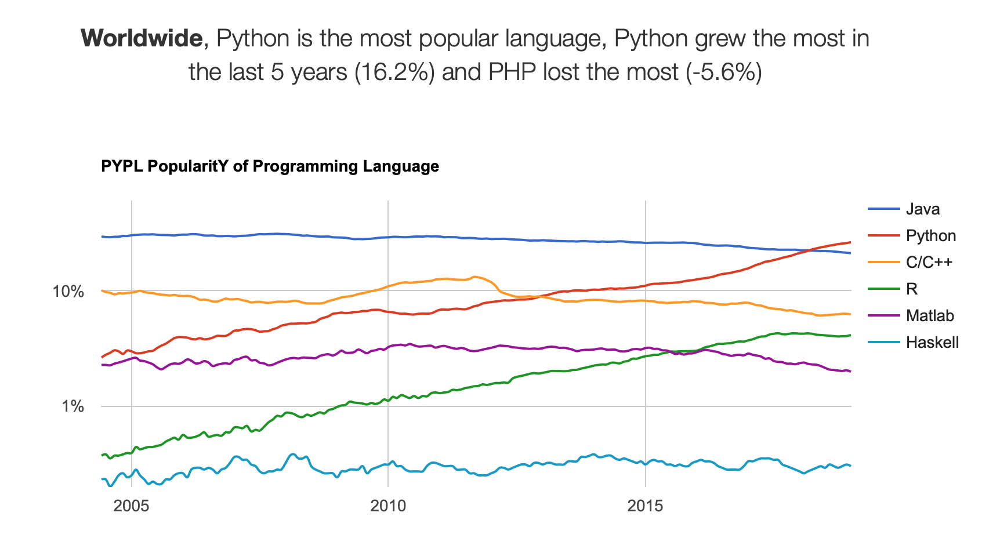

---
jupyter:
  jupytext:
    text_representation:
      extension: .md
      format_name: markdown
      format_version: '1.0'
      jupytext_version: 0.8.6
  kernelspec:
    display_name: Python 3
    language: python
    name: python3
---

# Python para ciencias aplicadas

```python
import this
```

Dependiendo de su carrera y elección de materias, en su estancia en el ITAM habrán usado MATLAB (sobre todo en cosas numéricas) o R (en cosas estadísticas). El objetivo de este curso es introducir Python como una mejor alternativa para sus clases y como lenguaje de programación general. Aunque R tenga sus casos de uso y MATLAB funcione, la [Popularidad de Python](http://pypl.github.io/PYPL.html) ha aumentado durante los últimos años.




Algo debe tener, ¿no?

+ **Python es entendible.** A diferencia de otros lenguajes de programación, Python favorece la legibilidad casi ante todo: el código debe ser fácil de leer y las soluciones deben ser fáciles incluso para alguien que no la sepa. Esto se traduce en menos tiempo gastado peleando con puntuación y llaves (sorpresa: no hay tales) y más tiempo disponible para atacar el problema. Así la computadora es una verdadera herramienta y se reduce el obstáculo de la sintaxis complicada.

+ **Python es multiparadigma.** Permite hacer programación orientada a objetos, funcional, e imperativa.

+ **Python es *open source*.** A diferencia de MATLAB, Python es de código abierto. Esto no sólo significa que es gratis, sino que tiene una **comunidad activa de desarrollo**, tanto científico como tecnológico. ¡Casi siempre existe una librería para lo que intentas resolver!

+ **Python es produccionalizable.** Tu código en Python puede hacer *scraping* de un sitio web, procesarlo, ajustar algún modelo estadístico y arrojar predicciones a un FTP. Por supuesto que esto no es ideal, pero es definitivamente más de lo que se puede hacer en MATLAB o R y suficientemente bueno para proyectos a escala pequeña. En el mismo lenguaje puedes hacer software y cómputo científico.

+ **Python es flexible.** Gran parte del retraso de Python en entrar al cómputo numérico es que es un lenguaje de programación *interpretado* y de *tipado dinámico*. No importa demasiado ahondar en detalles, pero más o menos significa que (1) el código que nosotros escribimos se traduce a lenguaje de máquina directamente al momento de la ejecución y que (2), también en la ejecución se revisa el tipo de las variables. Este sistema da libertad al programador y junto con un esfuerzo explícito para diseñar una buena sintaxis, se presta para un código muy limpio.


Vale la pena detenerse un poco en esta última observación. Parte de la filosofía de Python desde su concepción era tener un lenguaje minimal pero fácilmente extensible. En la siguiente sesión veremos que el ecosistema de cómputo científico y estadístico de Python, que utiliza librerías eficientes de Fortran y C consigue velocidades comparables con MATLAB (igual que MATLAB, numpu corre sobre [LAPACK](https://en.wikipedia.org/wiki/LAPACK) y [BLAS](https://en.wikipedia.org/wiki/Basic_Linear_Algebra_Subprograms) *sin perder todas las demás ventajas*. 


## Básicos

Las variables en python se asignan usando `=`. Por ejemplo

```python
x = 3
```

```python
x
```

Noten que no hubo necesidad de declarar la variable antes de utilizarla, y que puede por tanto cambiar de tipo libremente.

```python
x = 'Ahora soy una cadena'
```

```python
x
```

### Condicionales

Una vez más Python se mostrará mucho más limpio que otros lenguajes.

```python
x = 3
```

```python
if x < 0:
    print('x es negativo')
elif x==0:
    print('x es cero')
else:
    print('x es positivo')
```

No hay llaves ni paréntesis, pero la identación importa. Es un buen hábito de python usar cuatro espacios (y no tabulador) para identar código.


### Ciclos
La estructura de un `for` en python es

```python
for i in range(10):
    print(i)
```
Noten que python indexa desde cero. ¿Y si hubiéramos querido ir del 1 al 10?

```python
for i in range(1,11):
    print(i)

```

```python

```
